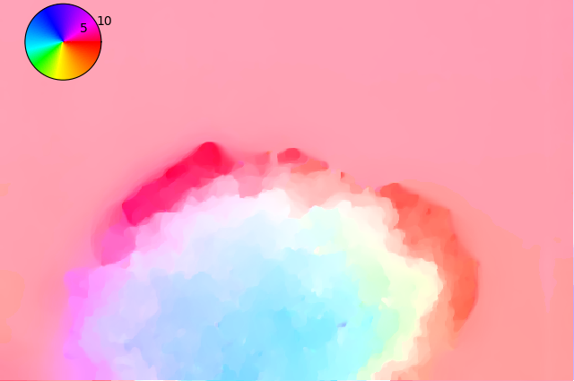

[](https://badge.fury.io/py/pyimof)
[](https://pyimof.readthedocs.io/en/latest/?badge=latest)
[](https://www.gnu.org/licenses/gpl-3.0)

Pyimof (for **Py**thon **im**age **o**ptical **f**low) is a pure
python package for dense [optical
flow](https://en.wikipedia.org/wiki/Optical_flow) estimation. Please
visit the [documentation](https://pyimof.readthedocs.io/en/latest/)
and the
[gallery](https://pyimof.readthedocs.io/en/latest/examples/index.html)
for more details.

## Installation

```
pip install pyimof
```

## Quick Example

Using Pyimov is as easy as

```python
from matplotlib import pyplot as plt
import pyimof
I0, I1 = pyimof.data.hydrangea()
u, v = pyimof.solvers.tvl1(I0, I1)
pyimof.display.plot(u, v)
plt.show()
```

to obtain


